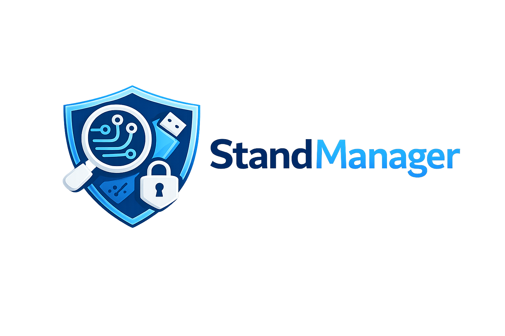

# StandManager

Outil PowerShell de collecte forensique, de durcissement et de supervision SSI
pour postes Windows isolés. Conçu pour être exécuté depuis une clé USB, sans dépendance Internet.

## Capacités principales

- Durcissement guidé : désactivation interactive de services Windows inutiles,
  avec sauvegarde CSV automatique et liste de services critiques protégés
  (jamais désactivés).
- Restauration à partir d'une sauvegarde CSV des services désactivés.
- Export des journaux Windows (`System`, `Application`, `Setup`, `Security`)
  au format EVTX, avec :
  - export incrémental basé sur `last_export.txt` ;
  - empreinte SHA-256 par fichier ;
  - rapport texte horodaté + manifest CSV ;
  - analyse optionnelle via Hayabusa (`csv-timeline`).
- Copie récursive des logs Anti-virus.
- Audit système : OS, pare-feu, BitLocker, antivirus, correctifs, membres
  Administrateurs, état de redémarrage en attente — sortie JSON + résumé texte.
- Analyse différentielle vs baselines (services, processus, réseau, tâches
  planifiées) avec création automatique des baselines si demandé.
- Sauvegarde réseau : archive ZIP par poste avec SHA-256 et manifest JSON,
  conservation de `baseline\` et `last_export.txt` sur la clé.
- **Dashboard météo SSI** (nouveau) : agrégation des analyses Hayabusa du
  parc isolé en un seul fichier HTML auto-contenu, lisible dans n'importe
  quel navigateur. Vision « en un coup d'œil » pour le RSSI.

## Pré-requis

- Windows 10/11.
- PowerShell 5.1 (préinstallé).
- Privilèges administrateur pour : triage services, restauration services,
  export EVTX.
- Hayabusa 3.x (optionnel) déposé à côté du script, chemin configurable.

## Installation

1. Copier `standmanager.ps1` et `standmanager.config.json` à la racine de la
   clé USB ou du dossier de travail.
2. (Optionnel) Déposer Hayabusa dans le dossier indiqué par
   `HayabusaRelativePath`.
3. Ajuster `standmanager.config.json` selon votre environnement.

## Utilisation

### Mode interactif (par défaut)

```powershell
.\standmanager.ps1
.\standmanager.ps1 -Interactive
```

### Mode CLI

```powershell
# Triage des services (admin requis)
.\standmanager.ps1 -Action Triage
 
# Restauration d'une sauvegarde de services
.\standmanager.ps1 -Action Restore
 
# Export EVTX + AV + Audit + Diff, sans analyse Hayabusa
.\standmanager.ps1 -Action Export -SIName SI03 -ComputerName LAP-001 -NoAnalyze
 
# Export complet avec analyse forcée
.\standmanager.ps1 -Action Export -SIName SI03 -ComputerName LAP-001 -Analyze
 
# Sauvegarde réseau
.\standmanager.ps1 -Action Save -SIName SI03
 
# Dashboard météo SSI (à exécuter depuis le poste de sauvegarde réseau)
.\standmanager.ps1 -Action Dashboard
 
# Pré-création de toutes les baselines manquantes (premier passage sur un poste)
.\standmanager.ps1 -Action Export -SIName SI03 -ComputerName LAP-001 -CreateBaseline -NoAnalyze
```
 
### Paramètres
 
| Paramètre         | Description                                                  |
|-------------------|--------------------------------------------------------------|
| `-Action`         | `Triage`, `Restore`, `Export`, `Save`, `Dashboard`, `Quit`   |
| `-Interactive`    | Force le menu interactif                                     |
| `-Analyze`        | Force l'analyse Hayabusa après export                        |
| `-NoAnalyze`      | Désactive l'analyse Hayabusa après export                    |
| `-SIName`         | Nom du SI (ex. `SI03`)                                       |
| `-ComputerName`   | Nom du poste (ex. `LAP-001`)                                 |
| `-CreateBaseline` | Crée automatiquement les baselines manquantes sans question  |
 
## Configuration
 
Fichier `standmanager.config.json`, situé à côté du script. Créé automatiquement
au premier lancement avec des valeurs par défaut.
 
| Clé                    | Rôle                                                              |
|------------------------|-------------------------------------------------------------------|
| `AVLogsPath`           | Dossier source des logs Anti-virus.                               |
| `HayabusaRelativePath` | Chemin relatif vers `hayabusa.exe` depuis le dossier du script.   |
| `SaveDestination`      | Chemin réseau de dépôt des archives.                              |
| `CompressionLevel`     | `Optimal`, `Fastest` ou `NoCompression`.                          |
| `HayabusaProfile`      | Profil Hayabusa pour `csv-timeline` (ex. `standard`, `verbose`).  |
| `EventLogs`            | Liste des journaux à exporter.                                    |
 
 
## Arborescence générée par poste
 
```
<racine>\
  <SIName>\
    <ComputerName>\
      System-yyyyMMdd-HHmmss.evtx
      Application-...evtx
      Setup-...evtx
      Security-...evtx
      Rapport_Export_yyyyMMdd-HHmmss.txt
      export_manifest.csv
      Analyse_<SI>_<Poste>.csv          (si Hayabusa actif)
      last_export.txt
      AV\...
      Audit\
        system_audit.json
        system_audit.txt
      baseline\
        services-baseline.csv
        process-baseline.csv
        network-baseline.csv
        scheduled-baseline.csv
        Sauvegarde_Services_yyyyMMdd_HHmm.csv
      diff-services.txt
      diff-processes.txt
      diff-network.txt
      diff-scheduled.txt
```
 
Au dépôt réseau, l'archive ZIP est accompagnée de :
 
- `<archive>.sha256.txt` (empreinte au format `sha256  filename`)
- `<archive>.manifest.json` (opérateur, taille, source, horodatage)
- d'un dossier `latest\` rafraîchi à chaque sauvegarde, qui contient :
  - `hayabusa.csv` (dernière analyse)
  - `system_audit.json`
  - `last_export.txt`
  - `rapport_export.txt`
  - `export_manifest.csv`
  - `meta.json`
 
Le dashboard météo lit uniquement `latest\` (pas besoin de dézipper).
 
## Dashboard météo SSI
 
Le dashboard agrège les analyses Hayabusa de tous les SI déposés sur le
partage réseau et produit un **fichier HTML auto-contenu** (aucune dépendance,
aucun serveur, aucun CDN). Idéal pour le suivi RSSI des postes hors-SIEM.
 
### Génération
 
```powershell
.\standmanager.ps1 -Action Dashboard
```
 
Le HTML est écrit dans :
 
```
<SaveDestination>\_Dashboard\Dashboard_SSI_YYYYMMDD-HHMMSS.html
<SaveDestination>\_Dashboard\latest.html
```
 
`latest.html` est un raccourci stable que vous pouvez épingler dans
l'explorateur ou les favoris du navigateur. Chaque génération produit aussi
un fichier horodaté pour historisation.
 
### Code couleur météo
 
| Icône | État        | Critère                                |
|-------|-------------|----------------------------------------|
| ⛈️    | Orage       | ≥ 1 alerte critique OU ≥ 5 élevées    |
| 🌧️    | Pluie       | ≥ 1 alerte élevée                     |
| ⛅     | Nuageux     | ≥ 10 alertes moyennes                 |
| 🌤️    | Éclaircies  | ≥ 1 alerte moyenne                    |
| ☀️    | Clair       | aucune alerte significative           |
| ❓     | Obsolète    | dernière collecte > 30 jours          |
| ❌     | Sans données | jamais analysé par Hayabusa          |
 
La météo d'un SI = la pire météo de ses postes (les obsolètes ne masquent
pas un poste réellement en orage).
 
### Contenu du dashboard
 
- **KPI globaux** : nombre de SI, postes, taux de couverture (< 90 j),
  total alertes critiques / élevées, postes oubliés.
- **Panel météo par SI** : une carte par SI, cliquable pour voir le détail.
- **Statistiques globales** : graphique SVG de distribution par criticité +
  heatmap SI × criticité.
- **Détail par poste** : tableau triable et filtrable (recherche libre +
  filtre par météo + filtre par SI), avec lien direct vers le CSV Hayabusa
  de chaque poste.
- **Top 20 règles déclenchées** : agrégation tous postes confondus, triée
  par criticité puis volume, avec liste des postes affectés.
- **Postes oubliés** : tous les postes dont la dernière collecte date de
  plus de 90 jours.
 
### Score de priorisation
 
Chaque poste reçoit un score : `crit × 100 + high × 20 + med × 5 + low`.
Le tableau est trié par score décroissant par défaut, donc le **poste à
traiter en premier est toujours en haut**.
 
## Logs locaux
 
Toutes les actions sont tracées dans `standmanager.log` (UTF-8, append-only).
 
## Sécurité
 
- Les services critiques (Defender, MpsSvc, EventLog, RpcSs, BFE, etc.) sont
  protégés : même si la liste générée par le questionnaire les contient, ils
  ne seront pas désactivés.
- Les fichiers `last_export.txt` et le dossier `baseline\` ne sont jamais
  supprimés lors de la sauvegarde réseau : seuls les fichiers archivés sont
  retirés de la clé.
- Chaque archive ZIP déposée porte son empreinte SHA-256 dans un fichier
  séparé, ce qui permet de vérifier l'intégrité à la réception.